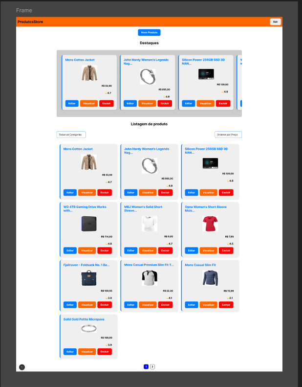

# Project Overview

This project is a product catalog where you can view featured products and a complete product list.

## Features

- **View Products**: Browse through the list of all available products.
- **Featured Products**: Easily access and view highlighted products.
- **Add New Products**: Register new products to the catalog.
- **Edit Products**: Modify existing product details.
- **Delete Products**: Remove products from the catalog.

## Getting Started

First, run the development server:

```bash
npm run dev
```

Open [http://localhost:3000](http://localhost:3000) with your browser to see the result.

You can start editing the page by modifying `app/page.tsx`. The page auto-updates as you edit the file.

This project uses [`next/font`](https://nextjs.org/docs/app/building-your-application/optimizing/fonts) to automatically optimize and load [Geist](https://vercel.com/font), a new font family for Vercel.

## Testing

To run the tests, run the following command:

```bash
npm test
```

## Figma

